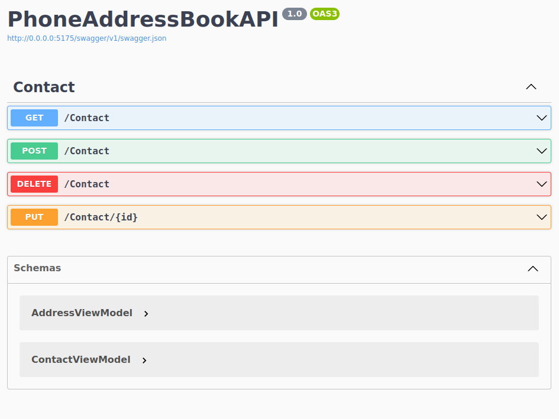

# Phone Address Book API

## Installation 

```
git clone https://github.com/VulpesDev/ContactBook_WebAPI ~/ContactBook_WebAPI && cd ~/ContactBook_WebAPI && docker-compose up --build
```
## Description

The Phone Address Book API is a RESTful web service for managing contacts and their addresses. It provides endpoints for creating, reading, updating, and deleting contacts, as well as searching for contacts by name.



## Features

- Create new contacts with multiple addresses and phone numbers
- Read contact details including addresses and phone numbers
- Update existing contacts
- Delete contacts and associated addresses
- Search for contacts by name
- Filter contacts by address

## Technologies Used

- C#
- ASP.NET Core
- Entity Framework Core
- MySQL
- Swagger UI
